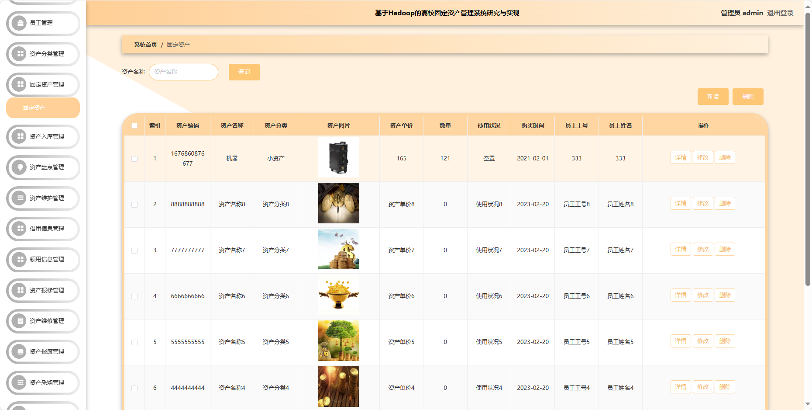
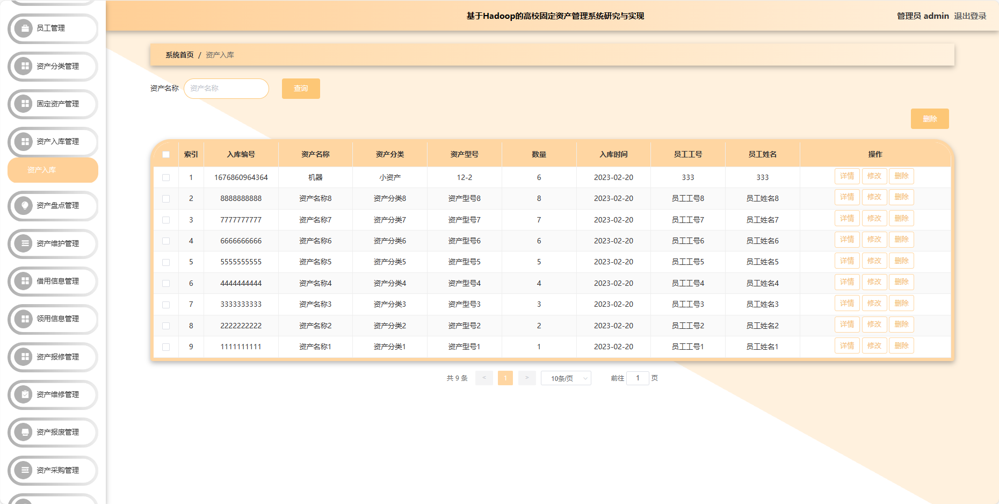
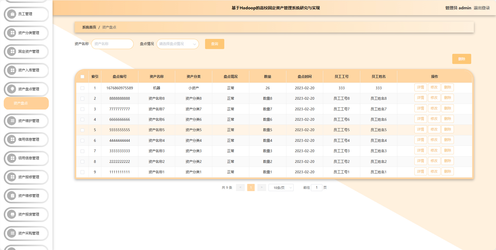
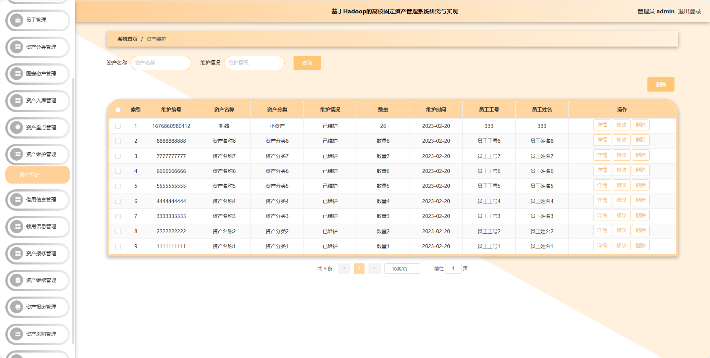
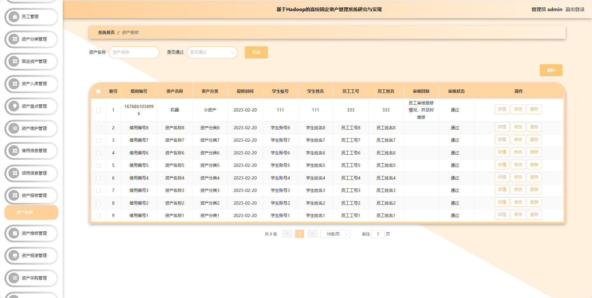
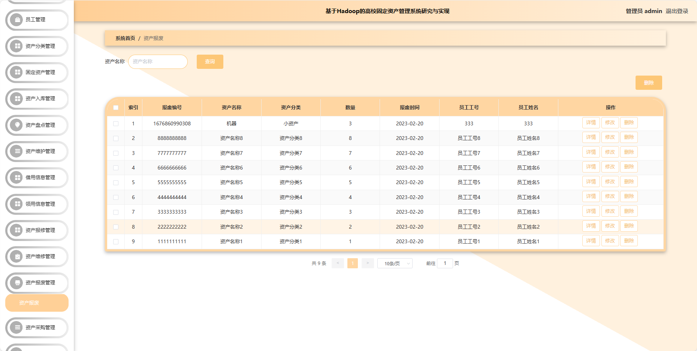
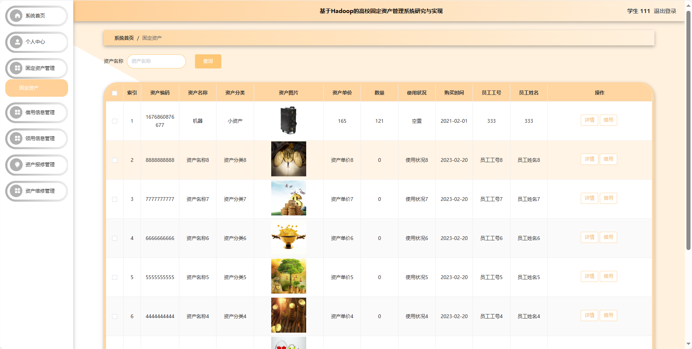
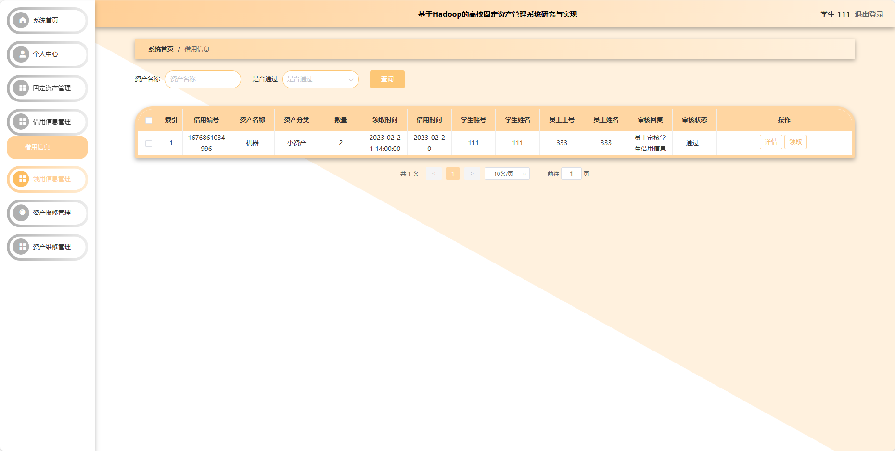
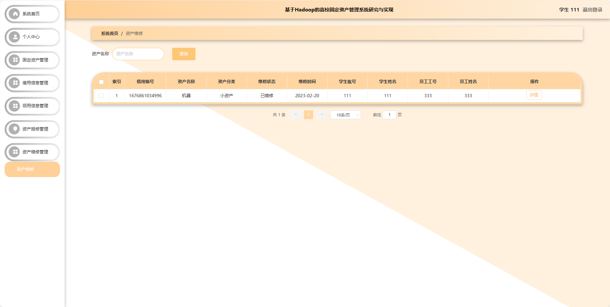
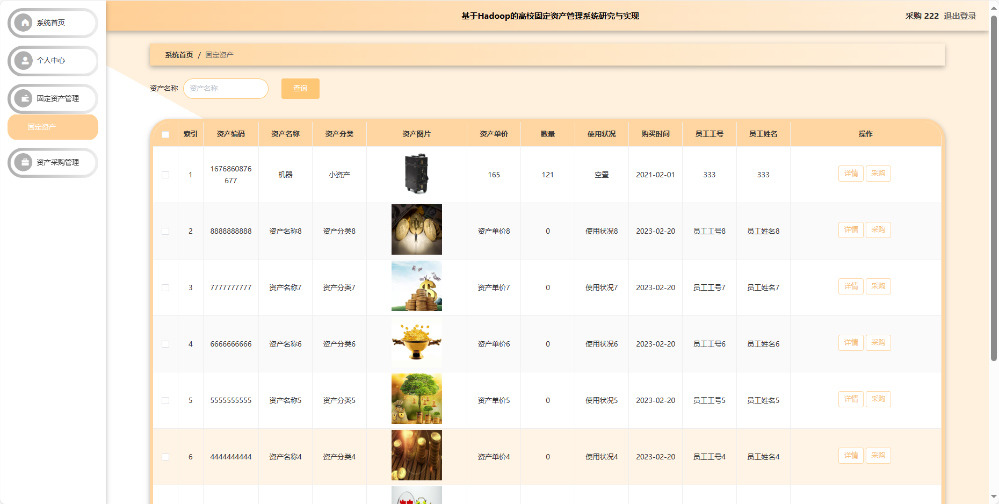

## 基于SpringBoot的高校固定资产管理系统

- <b>完整代码获取地址：从戎源码网 ([https://armycodes.com/](https://armycodes.com/))</b>
- <b>技术探讨、资料分享，请加QQ群：692619798</b> 
- <b>作者微信：19941326836  QQ：952045282</b> 
- <b>承接计算机毕业设计、Java毕业设计、Python毕业设计、深度学习、机器学习</b>
- <b>选题+开题报告+任务书+程序定制+安装调试+论文+答辩ppt 一条龙服务</b>
- <b>所有选题地址 ([https://github.com/YuLin-Coder/AllProjectCatalog](https://github.com/YuLin-Coder/AllProjectCatalog)) </b>

## 项目介绍
基于SpringBoot的高校固定资产管理系统，系统包含四种角色：管理员、学生，采购，员工，主要功能如下。

### 【管理员】:
1. 系统首页：提供管理员进入后台管理的入口。
2. 个人中心：管理员可以管理个人信息。
3. 学生管理：对高校学生信息进行管理。
4. 采购管理：负责固定资产的采购流程。
5. 员工管理：管理高校员工信息。
6. 资产分类管理：对固定资产进行分类管理。
7. 固定资产管理：整体管理固定资产。
8. 资产入库管理：记录新资产的入库信息。
9. 资产盘点管理：对固定资产进行盘点。
10. 资产维护管理：定期维护固定资产。
11. 借用信息管理：记录资产借用信息。
12. 领用信息管理：管理资产领用记录。
13. 资产报修管理：记录资产报修信息。
14. 资产维修管理：对资产进行维修管理。
15. 资产报废管理：管理报废资产的信息。
16. 资产调拨管理：记录资产的调拨信息。

### 【学生】:
1. 系统首页：提供学生进入后台管理的入口。
2. 个人中心：学生可以管理个人信息。
3. 固定资产管理：学生可以查看系统中的固定资产信息。
4. 借用信息管理：学生可以查看和管理自己的资产借用记录。
5. 领用信息管理：学生可以查看和管理自己的资产领用记录。
6. 资产报修管理：学生可以提交资产报修请求，记录报修信息。
7. 资产维修管理：学生可以查看自己提交的资产维修记录。

### 【采购】:
1. 系统首页：提供采购人员进入后台管理的入口。
2. 个人中心：采购人员可以管理个人信息。
3. 固定资产管理：采购人员可以查看系统中的固定资产信息。
4. 资产采购管理：负责固定资产的采购流程。

### 【员工】:
1. 系统首页：提供员工进入后台管理的入口。
2. 个人中心：员工可以管理个人信息。
3. 固定资产管理：员工可以查看系统中的固定资产信息。
4. 资产入库管理：员工负责记录新资产的入库信息。
5. 资产盘点管理：员工可以参与资产盘点。
6. 资产维护管理：员工负责资产的定期维护，记录维护情况。

## 项目技术
- 编程语言：Java
- 数据库：MySQL
- 项目管理工具：Maven
- 前端技术：HTML、CSS、JavaScript、Jquery、Vue
- 后端技术：Spring、SpringMVC、MyBatis

## 运行环境
- JDK版本：JDK1.8及以上
- 开发工具：IDEA、Ecplise、Myecplise都可以
- 数据库: MySQL5.7及以上
- Maven：maven3.0及以上
- Node：14.14.0及以上

## 运行截图

